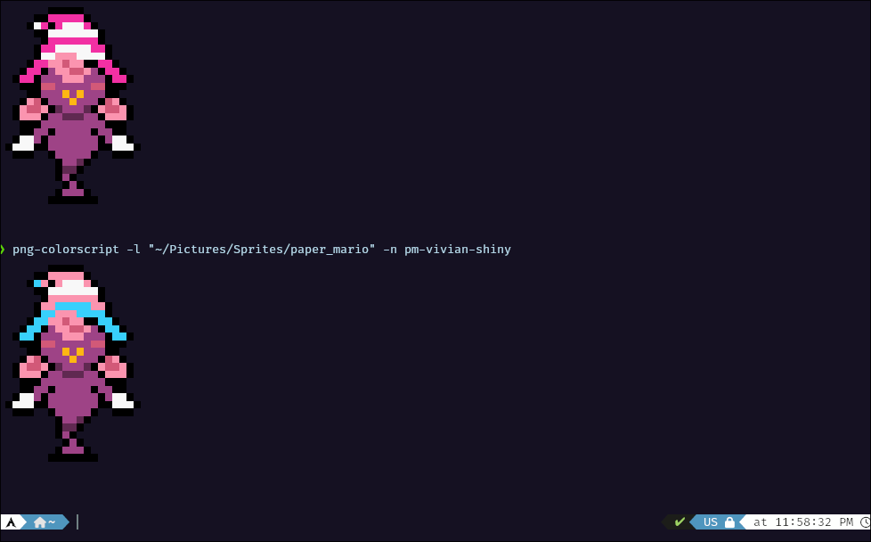

# PNG-Colorscript

Print randomly from a directory of PNGs to the terminal with colored characters.

## Installation

Clone the repository & run `install.sh`.

```sh
git clone https://github.com/neonpalms/png-colorscript.git
cd png-colorscript
sudo ./install.sh
cd ..
rm -rf png-colorscript
```

`install.sh` builds the python script into a standalone executable using a virtual environment, moves the executable into `/usr/local/bin/`, then cleans itself up.

You can change the install location by editing `install.sh`.

## Removal

Uninstalling is as simple as deleting the executable from `/usr/local/bin/`; that's all `uninstall.sh` does.

## Usage

```sh
> png-colorscript -h
usage: png-colorscripts -l '[PATH_TO_PNGS]' [-r | -n 'filename' | -rn 'image1,image2,image3' ]

CLI utility that prints out unicode images from PNGs located in a user-specified directory

options:
  -h, --help            Show this help message and exit
  -l, --location LOCATION
                        The path containing all of your PNGs.

modes:
  -r, --random          Print a random PNG from directory
  -n, --name NAME       Print a PNG by name from directory; do not include file-type
  -rn, --random-name RANDOM_NAME
                        Print a random PNG by name from a list of names, comma-separated WITHOUT
                        whitespace or file-types (e.g. 'image1,image2,image3')
```

Personally, I use a shell script to add random variants to the sprites it prints:

```sh
#!/usr/bin/bash

pngsdir="~/Pictures/Sprites/paper_mario/"  # Location of the sprites

shiny_odds=8  # 1/Odds to get shiny 

if [ $(( RANDOM % shiny_odds )) == 0 ]; then
  png-colorscript -l $pngsdir -n pm-vivian-shiny
else
  png-colorscript -l $pngsdir -n pm-vivian
fi
```



